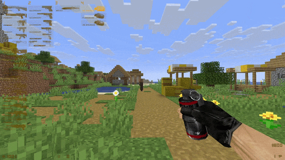
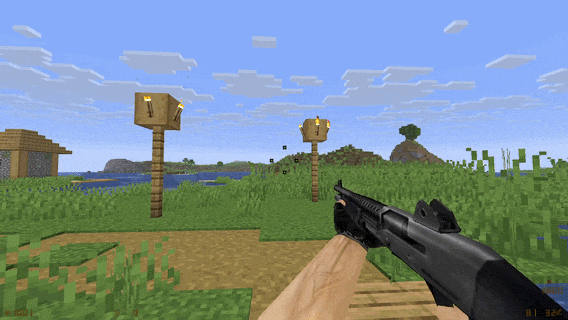

# CS16MC

A 26.2 Fabric mod, which reimplements Counter-Strike 1.6 weapons inside of Minecraft 26.2.

It integrates **ALL**, yes **ALL** the CS16 weapons into Minecraft, with remade functionality.

[](https://github.com/csgonovicecss/CS16MC/blob/main/controls.md)

## Showcase

### Block Damage


### Mob Damage


### Projectiles


### Weapons


## About

This is a little project of mine that I started because of the Rust rewrites, and I thought, why shouldn't I write a mod for Minecraft with Fabric Loom that reimplements CS16 weapons into Minecraft (its cool)??

## Features & Current Mod State

* All CS16 weapons (including grenades!!!)
* Weapons can damage mobs and blocks!
* Blocks such as weed or grass (most blocks that aren't full) are penetrable.
* Mobs are alerted by gunshots (radius depends on surrounding blocks and whether the weapon has a silencer on.)
* Grenade physics are basically identical to CS16's (really cool!)
* I tried to optimize this as much as possible and it is getting around stable 140 FPS on my old laptop. (It will be really laggy at like the first 5 seconds of the world generating.)
* It supports Sodium and other optimization mods. (Shaders aren't tested yet.)
* The mod is in a pretty good state, there are some known bugs, but they arent major.

## FAQ

### Will this get updated to newer versions?

Probably, but if it reaches a version that uses a new Java version, or just overall changes most things, I'll most likely still update it, but don't take my word for it.

### Will this get bug fixes?

Maybe, I don't plan to, only if it's gamebreaking.

### Was AI used?

Partially, I mostly used it to fix bugs in my code. I'm still learning Java.

### How do I build this from source?

This includes a Gradle wrapper and `gradlew.bat`.

So, `cd` into the main project folder and type:

```bat
gradlew.bat build
```

inside a Command Prompt. It will output a `.jar` file inside of the `build/libs` folder.

## Requirements

* Java 25+
* A copy of Counter-Strike 1.6 installed from Steam (dont pirate pls)

(if you plan on forking or redistributing this, im not saying that you need to, but you could credit me :D)
